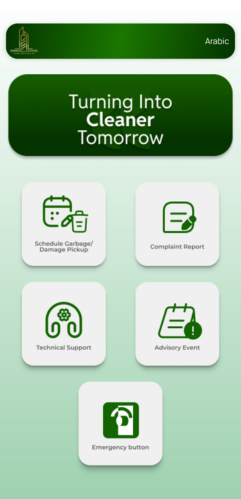
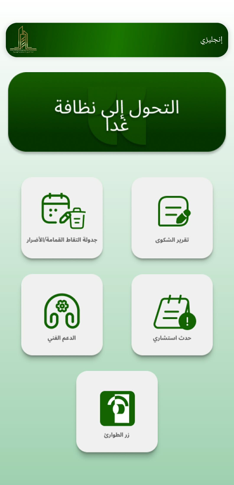
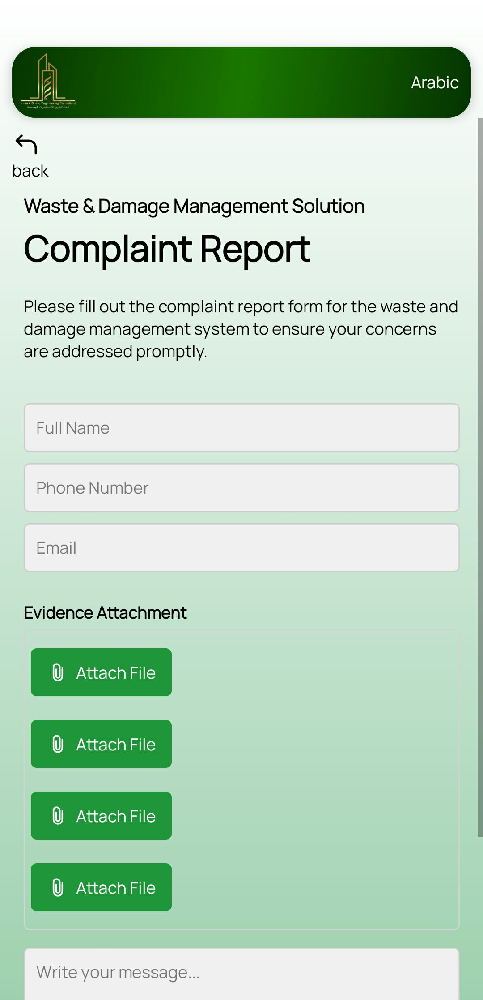
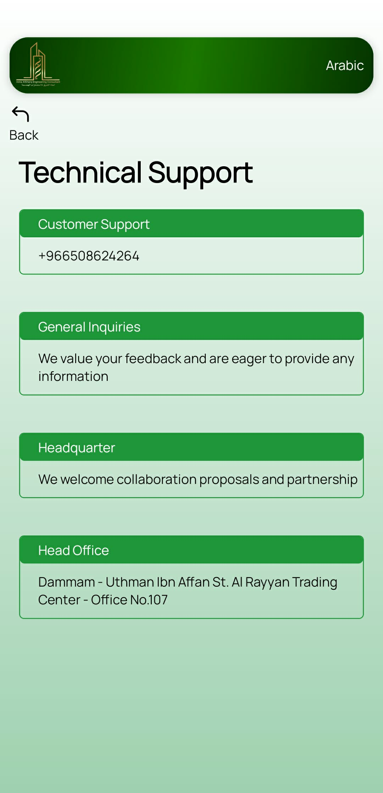
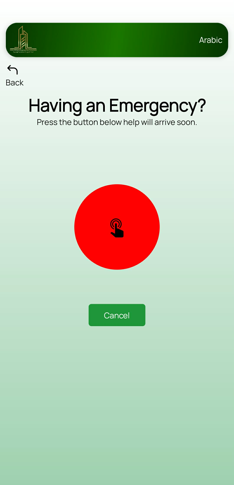

# Ajmal Waste and Damage Solutions

A cross-platform mobile app for **reporting, tracking, and managing waste and damage complaints**.  
Built with **React Native and Expo**, the app features a clean and intuitive interface, multi-language support, and navigation to key sections like scheduling, complaints, technical support, advisories, and emergencies.

---

## Features

- **Submit Complaint Forms** – Report waste or damage issues easily.
- **Schedule Management** – View and manage schedules related to waste collection.
- **Technical Support** – Access technical assistance and support features.
- **Advisory & Events** – Stay updated with advisories and events.
- **Emergency Contacts** – Quick access to emergency support.
- **Multi-language Support** – Toggle between English and Arabic.
- **Responsive UI** – Works on Android, iOS, and Web using Expo.

---

## Tech Stack

- **Frontend:** React Native, Expo  
- **Navigation:** React Navigation (stack & bottom-tabs)  
- **UI Components:** React Native Paper, LinearGradient, Vector Icons  
- **Utilities:** Expo Image Picker, Expo SQLite, Expo Location, React Native Localize  
- **Languages:** JavaScript, JSX  

---

## Screenshots

| Home Screen | Home Screen (Arabic) | Complaint Screen |
|------------|--------------------|----------------|
|  |  |  |

| Tech Support Screen | Emergency Screen |
|-------------------|----------------|
|  |  |

